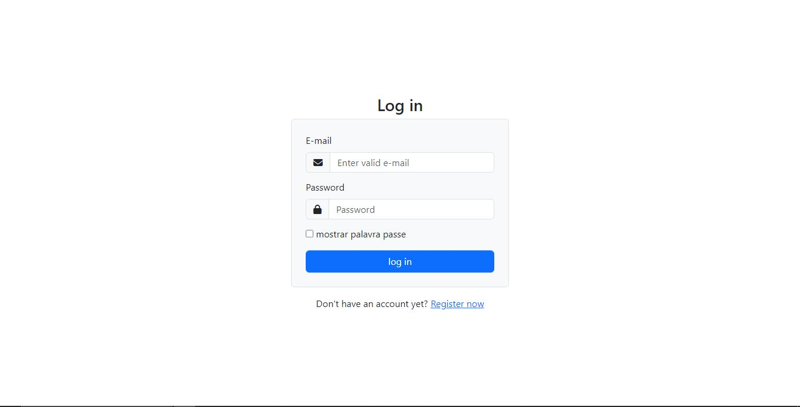
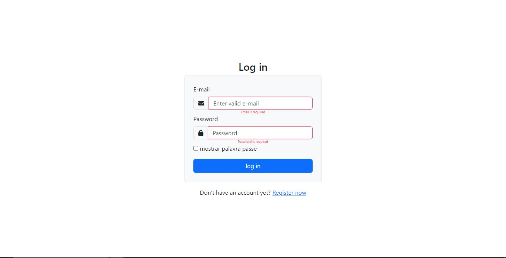
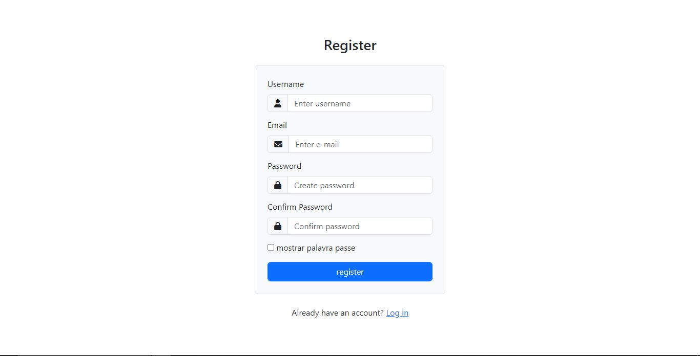
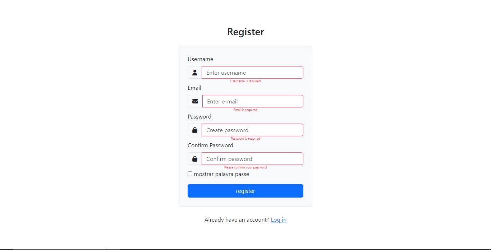

# Formulario de Validação de inputs de log in e register usando javascript

Este formulario foi criado usando HTML, CSS Bootstrap, FontAwesome e JavaScript. 
Atraves do JavaScript faz se verificação dos campos de formulario  se foram preenchidos correctamente antes de enviar os dados

# Tecnologias Utilizadas
- JavaScript
- HTML
- CSS Bootstrap
- FontAwesome
- Jquery

## Imagns
Aqui estão algumas capturas de tela do puzzle em acção:

*Tela Inicial de Log in*

*Aspecto do formulario de log in quando o usuario tenta submeter sem prencher algum campo*

*Tela Inicial de register*

*Aspecto do formulario de register quando o usuario tenta submeter sem prencher algum campo*